# Faire tourner une « Software Factory » efficacement à l'échelle d'Uber

> **Copie archivée à usage personnel.** Copyright (c) Uber Technologies, Inc. Tous droits réservés.
> Source : https://x.com/ubereng/status/2093444169037762840
> Éditeur : Uber Engineering (@UberEng) - auteur du post : @udaykiran
> Publié : 2026-08-28 21:02 UTC - Récupéré : 2026-09-01
> Traduction française non officielle de [`article.md`](article.md), réalisée pour référence personnelle.

---

Auteur du post :

[@udaykiran](https://x.com/udaykiran)

# Introduction

Les outils d'IA sont désormais intégrés à chaque phase du développement logiciel chez Uber. Plus de 70 % des pull requests sont attribuées à des agents locaux ou cloud. Les ingénieurs ont construit plus de 3 600 compétences d'agents (« agent skills ») couvrant tout le cycle de vie du développement logiciel, et exécutent plus de 30 000 exécutions de compétences par jour.

À la conférence AI Engineer 2026, nous avons présenté

[notre vision](https://youtu.be/17-YSUHo6Lk?si=EbqFAc2UwHX_3wSc)

de la Software Factory ainsi que les briques de base et les agents managés que nous construisons tout au long du cycle de vie. À mesure que nous avançons vers cette vision, une part croissante des sessions n'est plus initiée par des humains mais par des agents managés automatisés : revue de code, auto-réparation des échecs de CI, réalisation complète de PR E2E avec validation visuelle, triage des alertes d'astreinte, débogage des bugs entrants et traitement de tâches de maintenance de code variées, avec revues et escalades humaines.

Comme le montre la Figure 1, de février à août 2026, le nombre d'utilisateurs actifs hebdomadaires sur l'ensemble de nos offres agentiques et de nos employés (ingénieurs et non-ingénieurs) a été multiplié par 7, et les requêtes agentiques hebdomadaires par 9,4. Pendant ce temps, notre dépense IA totale s'est relativement stabilisée depuis avril grâce aux optimisations menées sur tous les fronts.

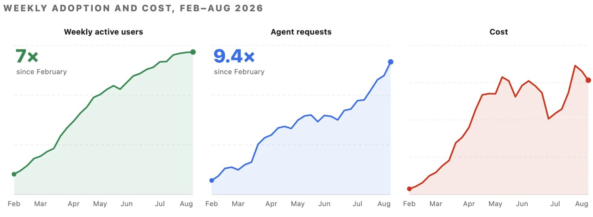

Figure 1 : Utilisateurs actifs hebdomadaires, requêtes d'agents et coût de février à mi-août 2026, utilisateurs dédoublonnés entre outils.

Comme l'adoption, la nature des charges de travail et les mises à niveau de modèles évoluent en continu, isoler nos propres gains d'optimisation impose de figer un modèle, puisque le comportement change à chaque montée de version et à chaque famille de modèles. C'est ce que nous avons fait de février à juillet : le coût pour 1 000 requêtes modèle a baissé de près de 34 % par rapport à son pic, et le coût par session de 52 % par rapport à son pic de juin.

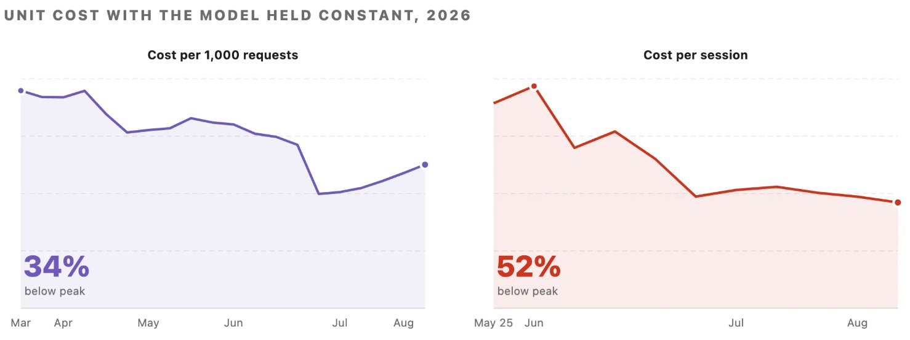

Figure 2 : Impact de l'optimisation des coûts, à modèle constant. *Les données de coût/session démarrent fin mai.

Cet article explique comment nous pensons notre software factory : les quatre couches dans lesquelles s'exécutent les sessions d'agents, l'équation de coût que nous utilisons pour décomposer la dépense, comment nous mesurons chaque terme, et comment nous optimisons ces termes sur chaque couche.

Tous les tarifs et métriques fournisseurs de cette comparaison reposent sur des informations publiques, les gains d'efficacité provenant d'un routage plus intelligent de nos charges internes Uber au sein d'une tarification standard. Les réductions de coûts que nous mesurons sont propres à notre environnement et vos résultats peuvent varier selon votre base de code, la taille de vos équipes et vos workflows d'agents ; en revanche, la méthodologie — benchmarker du travail réel et optimiser à la fois la précision et le coût — est universellement applicable.

## La Software Factory et son équation de coût

Quatre couches d'usage des agents

Nous organisons l'usage de l'IA en quatre couches, de la plus spécialisée à la plus générale. Comme le montre la Figure 3, plus la couche est haute, plus nous contrôlons le coût, la qualité et le choix du modèle.

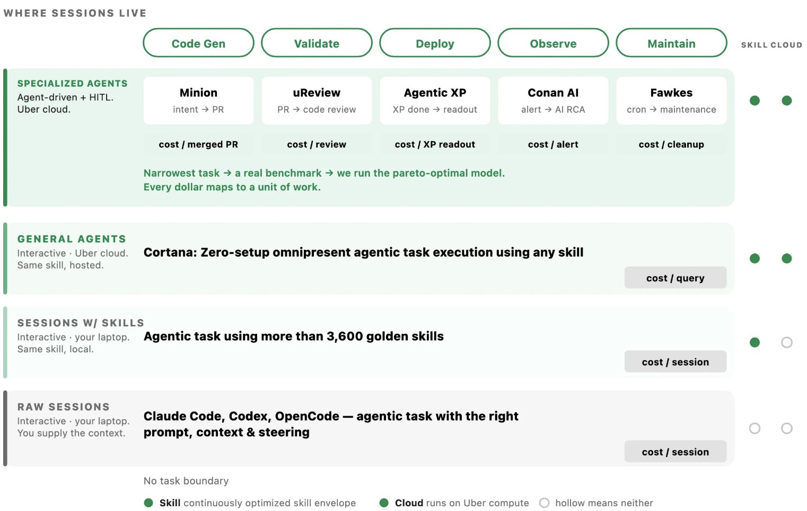

Figure 3 : Les quatre couches où s'exécutent les sessions d'agents.

L'équation de coût

Sur n'importe laquelle des couches ci-dessus, nous pouvons décomposer le coût d'une session agentique en les termes suivants, que nous pouvons mesurer et optimiser indépendamment.

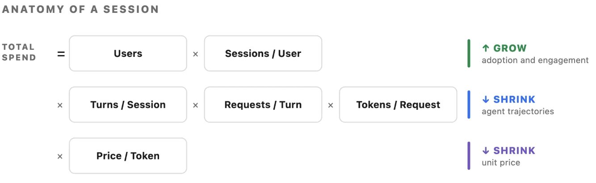

Figure 4 : La dépense totale, décomposée en six termes qui se multiplient.

Les deux premiers termes représentent l'adoption et l'engagement, que nous voulons faire croître sur l'ensemble de notre base d'utilisateurs, que l'usage soit interactif ou que des agents traitent les tâches pour eux. Les trois termes du milieu offrent les opportunités d'optimisation : le travail que l'agent fait pour son propre compte, en plus de la demande réellement formulée par l'ingénieur. C'est là que porte l'essentiel de nos efforts. Cela inclut les mécanismes qui aident les agents à planifier plus vite, à réduire les tours de boucle inutiles ou les erreurs, à optimiser les tokens d'entrée, et plus encore.

## Comment nous mesurons

Voici l'ensemble complet des métriques que nous suivons chaque semaine et chaque mois, et qui nous permettent de prévoir et de planifier nos efforts à court et long terme.

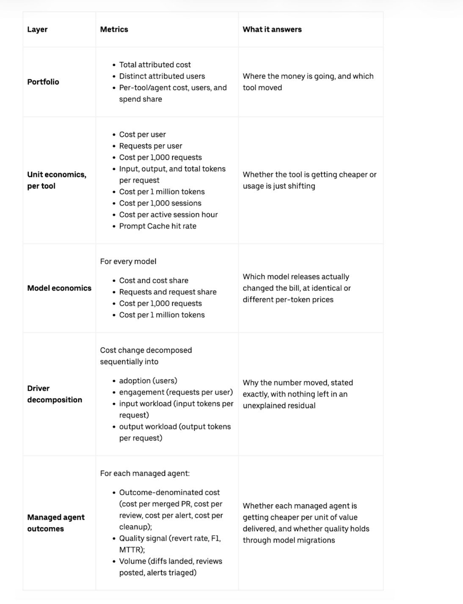

## Leviers d'optimisation

Dans les sections suivantes, nous détaillons les principaux leviers utilisés pour optimiser chaque partie de l'équation de coût. Certains de ces leviers agissent sur une ou plusieurs lignes de l'équation.

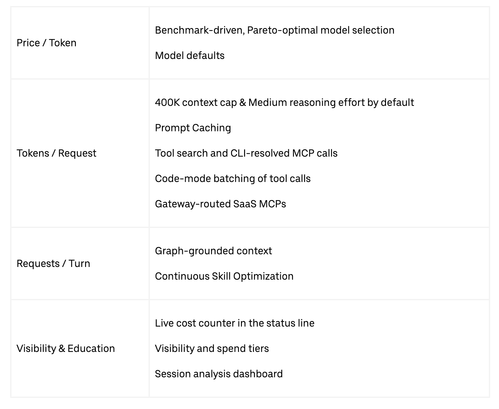

## Optimiser le prix / token

Le fournisseur fixe le prix du token. Nous choisissons quel modèle exécute quelle charge de travail. Sur toutes les couches de nos agents managés, nous choisissons le modèle le plus Pareto-efficient pour cette charge. Pour nous, Pareto-efficient signifie : coût par tâche accomplie, qualité de sortie et fiabilité du modèle.

Sélection de modèle pilotée par benchmark

La sélection de modèle se fait en quatre étapes, identiques pour chaque agent managé que nous opérons.

- Construire un benchmark à partir du travail réel de l'agent.

- Exécuter l'agent sur un harnais capable de servir n'importe quel modèle, frontier ou open-weight, derrière une interface unique.

- Basculer vers ce qui est Pareto-optimal, et continuer à bouger. La frontière se déplace toutes les quelques semaines.

Pour la suite, nous affinons en continu la performance de nos charges de travail en exploitant les données agrégées de nos agents managés pour tester et déployer diverses stratégies de routage de modèles.

Par exemple, nous utilisons uReview, qui assure la revue de code par IA de toutes les pull requests. Nous avons construit son benchmark à partir de vraies pull requests contenant des bugs connus, classés en facile, moyen et difficile. Nous mesurons précision, rappel et F1 sur ces bugs, plus le coût par revue, la latence, les timeouts et le bruit. Comme le montre la Figure 5, le changement de modèle a amélioré notre F1 tout en réduisant fortement le coût/PR. Sur la figure, la ligne pointillée est la frontière de Pareto. Tout ce qui se trouve en dessous et à gauche est dominé par une option moins chère ou meilleure.

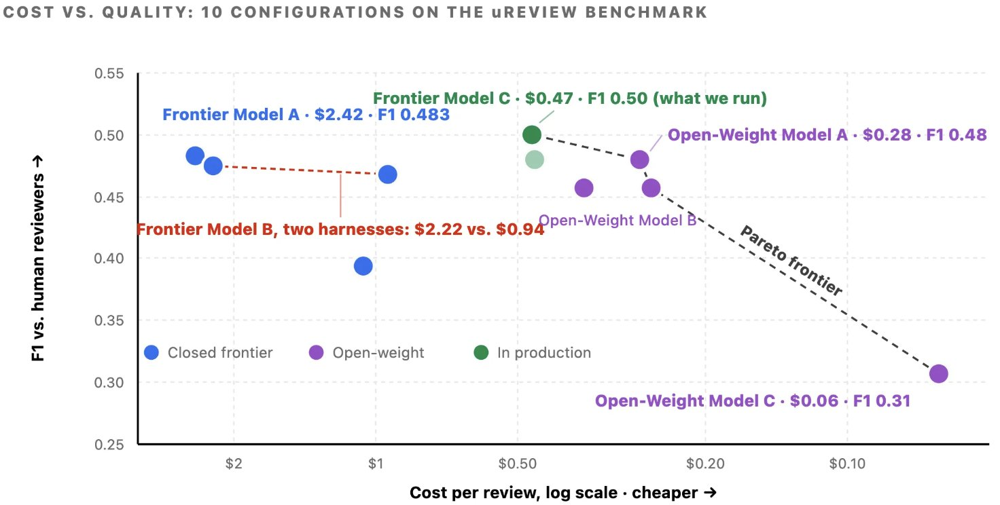

Figure 5 : Toutes les configurations testées pour uReview.

En nous appuyant sur des milliers de PR réelles issues de nos grands monorepos, nous disposons aussi en interne d'un Uber SWE Benchmark qui fait tourner des modèles frontier et open-weight sur différents types de tâches. Nous l'utilisons pour éclairer la sélection de modèle sur l'ensemble de nos agents managés du SDLC.

Choix du modèle par défaut

Dans l'interface interactive, le coût unitaire du token reste fixe ; en revanche, on peut piloter stratégiquement la répartition des tokens entre modèles. Deux réglages par défaut gouvernent principalement cette répartition : le modèle initial de session et le modèle des sous-agents.

Le réglage par défaut des sous-agents s'est révélé le levier le plus efficace, et son importance ne cesse de croître. La proportion de sessions démarrant des sous-agents augmente régulièrement, les dernières capacités des modèles rendant l'orchestration multi-agents plus efficace. Comme les sous-agents exécutent des tâches bien définies avec des entrées précisées, qui ne nécessitent souvent pas un raisonnement de niveau frontier, nous les faisons pointer par défaut vers un modèle plus faible et plus économique, tout en autorisant une surcharge manuelle. Le modèle principal se charge de la décomposition et de l'évaluation des tâches, les sous-agents exécutent le travail.

## Optimiser les tokens / requête

Chaque tour renvoie l'intégralité de l'historique de conversation, du contexte projet et des résultats d'outils. Tout ce qui réduit la charge utile par requête se cumule sur toute la session.

Réglages par défaut

Tous les harnais interactifs utilisent un wrapper unifié pour la gestion de l'installation, la configuration, l'authentification et la visibilité des coûts. Deux configurations par défaut standardisées réduisent directement la consommation de tokens par requête :

- Compaction automatique déclenchée à 400k tokens, même pour les modèles à fenêtre de contexte de 1M : ce seuil équilibre la performance du modèle face aux rafales de cache et au coût des tokens d'entrée répétés. Nos mesures montrent une réduction significative des tokens d'entrée par requête à l'échelle de la flotte.

- Effort de raisonnement par défaut à Medium : les tokens de sortie, y compris les tokens de raisonnement interne, sont facturés à un multiple du tarif des tokens d'entrée sur les modèles principaux ; ce réglage réduit donc directement la dépense sur la catégorie de tokens la plus coûteuse. Pour une large catégorie de tâches, le raisonnement Medium offre un bon compromis coût/qualité.

Stratégie de mise en cache des prompts

Notre stratégie de cache de prompts découle de l'économie des lectures et écritures de cache côté fournisseur. Puisque chaque tour retransmet tout l'historique de conversation, mettre en cache le contexte précédent évite d'en repayer le plein tarif à répétition et ramène les lectures suivantes à seulement 0,1x le tarif standard des tokens d'entrée. Les surcoûts d'écriture varient toutefois : une entrée de cache à 5 minutes coûte 1,25x, une entrée à 1 heure 2x. Le choix d'une TTL (durée de vie) optimale dépend donc de la durée des intervalles entre tours. Les TTL disponibles sont 5 minutes et 1 heure chez Anthropic®, et 30 minutes chez OpenAI®.

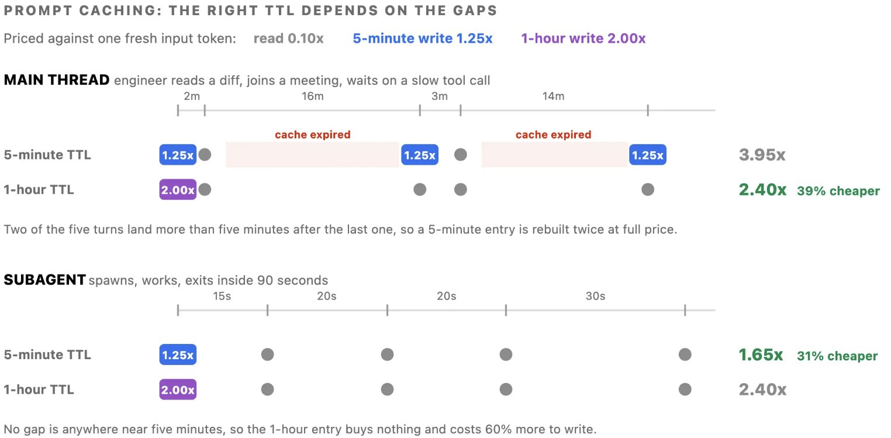

Figure 6 : Comparaison de 5 tours sous les deux durées de TTL.

Comme les ingénieurs laissent souvent leurs sessions interactives inactives plus de 5 minutes, nous sommes passés de la TTL par défaut de 5 minutes à une fenêtre d'1 heure. Ces fréquents temps morts invalidaient auparavant le cache de préfixe, imposant des reconstructions de contexte coûteuses au plein tarif. Les sous-agents, à l'inverse, conservent une TTL de cache de 5 minutes, leur exécution se limitant à des tâches uniques et de courte durée.

Exécuter les outils MCP via le shell

Chez Uber, toutes les interactions MCP (Model Context Protocol) passent par une passerelle unifiée. Ce point d'entrée unique couvre plus de 1 000 serveurs MCP, internes comme SaaS tiers, et permet une authentification et une application des politiques centralisées.

Or, le MCP standard charge tous les schémas d'outils dans chaque session, que l'ingénieur les invoque un jour ou non. Par exemple, avec plus de 100 outils installés, ce préchargement ajoutait environ 50 000 à 70 000 tokens de surcharge de schémas au prompt initial, ensuite renvoyés à chaque tour de contexte.

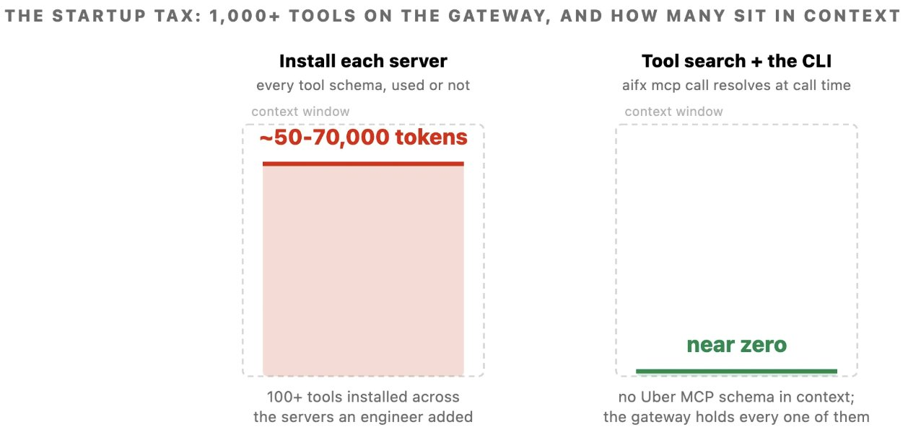

Figure 7 : Ce qu'un agent transporte déjà en début de session, selon 3 façons d'accéder aux mêmes outils.

Pour traiter cette inflation de contexte, nous avons introduit deux mécanismes d'optimisation complémentaires :

- Résolution d'outils en CLI : remplace l'intégration MCP directe en laissant le modèle exécuter une commande shell. La CLI résout et invoque dynamiquement l'outil requis auprès de la passerelle au moment de l'appel, éliminant les schémas MCP Uber du contexte de session. Les 1 000+ outils MCP de notre passerelle interne sont projetés en commandes CLI.

- Recherche d'outils : passe à l'échelle de milliers d'outils en laissant le modèle chercher dans le catalogue et ne charger que les outils nécessaires, à la demande. Cette approche limite l'inflation de contexte, réduit typiquement les tokens consommés par les définitions d'outils, et maintient une précision de sélection élevée même quand la bibliothèque d'outils grandit, évitant la dégradation associée aux grands ensembles d'outils.

Code-Mode

Quand les outils appellent des fonctions directement sous forme de commandes shell, les modèles peuvent regrouper plusieurs actions dans un seul script. Ce regroupement est particulièrement avantageux pour les protocoles d'outils bavards. Dans un workflow MCP standard, chaque action exige un tour de modèle distinct pour émettre une requête, charger la réponse brute dans la fenêtre de contexte et traiter les résultats séquentiellement. Par exemple, exécuter une simple requête SQL suppose de soumettre la requête, d'interroger le statut 2 à 5 fois, puis de récupérer la sortie. Le code-mode ramène tout ce flux à une boucle Python automatisée, en gardant les interrogations intermédiaires hors du contexte actif du modèle. Comme le montre la Figure 8, à gauche le modèle participe à la boucle d'attente et chaque réponse atterrit dans son contexte ; à droite la boucle tourne dans un sous-processus et seul le résumé revient.

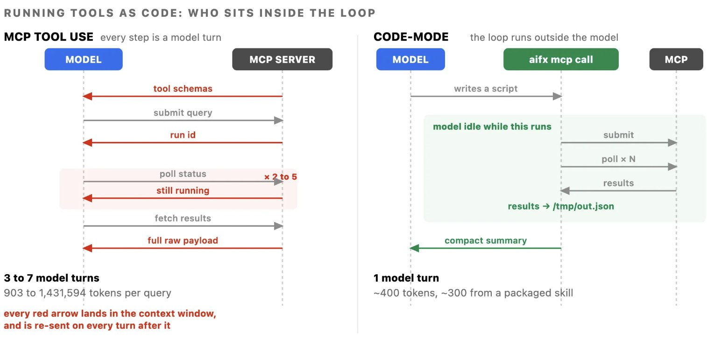

Figure 8 : La même requête entrepôt, dans les deux approches.

Nous l'avons mesuré en exécutant 5 requêtes SQL identiques par les deux chemins dans la même session :

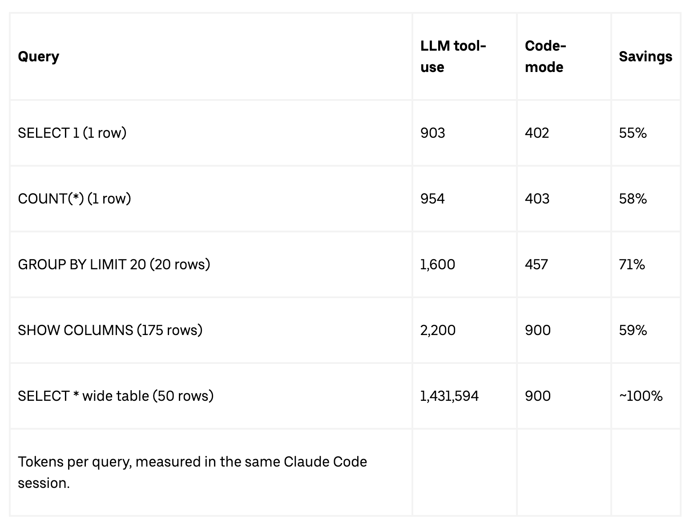

Les trois premières lignes résument le constat principal : même pour des jeux de résultats minimes, très en deçà des limites de taille de réponse, le code-mode réduit la consommation de tokens de plus de 50 %. Ces gains ne viennent pas d'un contournement de gros volumes de données mais de la suppression de surcharges inutiles : initialisation de schémas, interrogations multi-tours et raisonnement redondant étape par étape.

Les workflows en masse amplifient l'effet : la boucle qui aurait coûté N tours de modèle devient un seul script et les économies dépassent 90 %. En déployant plus de 25 compétences code-mode préconstruites pour nos serveurs MCP les plus sollicités, nous garantissons que les workflows standards empruntent par défaut le chemin le plus économique.

MCP SaaS

Gérer les logiciels tiers s'est révélé nettement plus difficile que nos serveurs internes. Les éditeurs conçoivent leurs serveurs MCP pour exposer l'intégralité des capacités produit, faute de pouvoir anticiper l'usage de chaque client. Par exemple, une suite bureautique regroupe 49 outils dans un seul serveur, soit ~22 000 tokens de schémas, tandis que des éditeurs de messagerie et de suivi de projet embarquent respectivement 34 et 46 outils. Charger deux ou trois serveurs éditeurs fait porter à l'agent plus de schémas que le fichier en cours d'édition, avant même que l'utilisateur ait saisi un prompt.

Pour y remédier, nous routons les serveurs MCP SaaS via notre passerelle MCP, avec le même mécanisme que nos MCP internes. Nous exposons également tous ces MCP en CLI, invocables depuis n'importe quelle surface agentique. Nous rédigeons en plus des compétences dédiées dans notre plugin code-mode pour chaque serveur, afin d'encapsuler les workflows courants. Cela a débloqué des workflows agentiques efficaces chez de nombreux éditeurs SaaS.

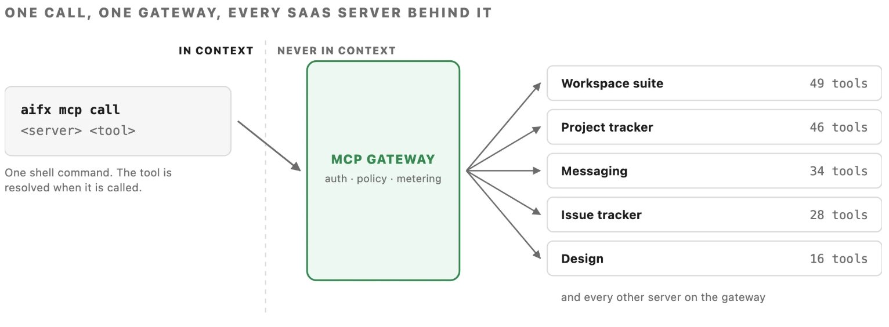

Figure 9 : Chaque serveur MCP SaaS est exposé derrière notre passerelle MCP pour garantir un accès unifié et efficace.

Optimiser les requêtes / tour

Un agent non ancré échoue lentement plutôt qu'à moindre coût : il renvoie sans cesse une fenêtre de contexte qui grossit pour aller chercher à un endroit de plus. Fournir une information plus riche en amont reste le levier le plus puissant pour réduire ce coût de recherche.

Ingénierie du contexte

Dans la vaste base de code et l'écosystème de données d'Uber — des centaines de millions de lignes de code et des milliers de tables — les agents passent l'essentiel de leurs tours à localiser l'information plutôt qu'à produire du code. Pour y répondre, nous avons construit l'AI Context Graph : un réseau unifié de 24 millions de nœuds et 80 millions d'arêtes, réparti sur 86 types de nœuds et 117 types d'arêtes. Il intègre les données de plus de 30 systèmes internes — services, équipes d'ingénierie, journaux d'incidents, pull requests, documents d'architecture, déploiements, jeux de données et historique des requêtes d'usage des tables — et permet à n'importe quel agent de l'interroger en langage naturel.

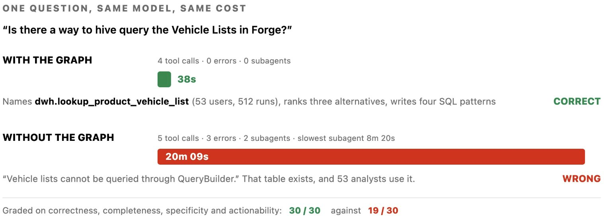

Figure 10 : Comparaison des chemins d'exécution pour un prompt identique soumis au même modèle, avec et sans ancrage sur le graphe.

L'agent ancré a interrogé l'historique d'usage, identifié la table précise utilisée par plus de 50 analystes et fourni la réponse en 38 secondes. À l'inverse, l'agent non ancré n'avait aucune visibilité sur cette table : il a passé 20 minutes à inspecter du code de service, lancé 2 sous-agents et rencontré 3 erreurs avant de conclure à tort que le jeu de données n'était pas interrogeable.

## Visibilité et pédagogie

Les leviers ici sont la visibilité et les boucles de retour qui aident ingénieurs et agents à converger plus vite.

La barre de statut

Nous avons placé un compteur de coût en direct dans la barre de statut du harnais, qui suit la dépense en temps réel par harnais et tous harnais confondus pour chaque utilisateur.

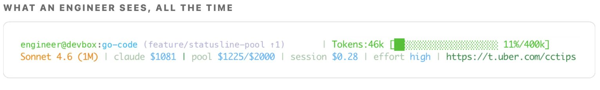

Figure 11 : La barre de statut, avec l'analyseur de session et le guide d'efficacité livrés avec elle.

Visibilité et paliers de dépense

Plutôt que d'imposer des plafonds stricts, nous avons mis en place un suivi de dépense en temps réel et des relances automatiques :

- Compteur live en barre de statut. Le coût de la session en cours est toujours visible dans le terminal.

- Pool de harnais. Un palier partagé entre tous les harnais interactifs, plutôt que des budgets par outil. Et des paliers séparés pour les agents managés.

- Relances Slack. Alertes à 50/80/100 % de la dépense attendue, pour que les ingénieurs aient le temps de s'organiser.

- Flux d'approbation simples. Validation manager pour monter de palier, avec propagation rapide.

- Compétence de vérification des coûts et conseils. Une compétence tableau de bord pour obtenir une ventilation des coûts à la demande, et un coaching en direct dans la barre de statut.

Cela permet aux ingénieurs d'évaluer eux-mêmes le ROI d'une tâche tout en limitant les dépenses qui s'emballent.

Tableau de bord d'analyse de session

Si la barre de statut affiche la dépense totale d'une session, elle ne dit rien des postes de coût ni des actions concrètes à mener. Les recommandations générales donnent des principes de haut niveau mais ne peuvent pas évaluer le workflow de chaque développeur. Le tableau de bord d'analyse de session comble ce manque en inspectant directement les artefacts de session.

Intégré au runtime, il ne demande aucune installation ni activation. L'exécution de la compétence « tableau de bord de coût » analyse toutes les traces de session de l'utilisateur, sur les bacs à sable locaux et cloud distants, tous harnais confondus. Plutôt qu'un chiffre agrégé, il signale 16 anti-patterns distincts au fil des sessions, chacun associé à son impact financier et à une remédiation ciblée. Parmi les catégories :

- Routage de modèle sous-optimal : exécuter sur Opus des sessions multi-tours simples que Sonnet traiterait sans peine.

- Inflation de la fenêtre de contexte : de grosses charges utiles MCP (par exemple des réponses de 40 Ko) qui persistent dans le contexte et sont refacturées à chaque tour suivant.

- Inefficacité liée à l'expiration du cache : reprendre une session après une longue pause, quand les caches de prompts expirés imposent une reconstruction du préfixe au plein tarif.

- Surcharge d'initialisation du prompt : précharger 100 000 tokens d'instructions système et de définitions d'outils avant même la moindre saisie de l'utilisateur.

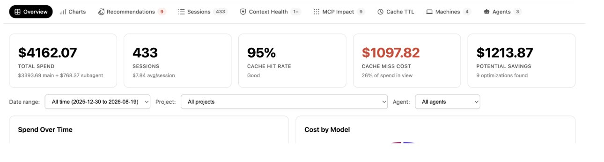

Figure 12 : Le tableau de bord de coût par session identifie les gaspillages et les économies potentielles.

Et ensuite ?

Les chantiers en cours incluent :

- Élargir la flotte d'agents managés : pour chaque nouvel agent, nous suivons la même feuille de route — définir les métriques de résultat visées, constituer des benchmarks d'évaluation, identifier un modèle Pareto-optimal. Cette approche systématique vise à faire monter chaque étape du SDLC dans le modèle de maturité de la factory.

- Routage dynamique de modèles : nous étendons la couverture de nos benchmarks à davantage de langages, de dépôts et de modalités d'agents. Un routage efficace repose fortement sur une évaluation exhaustive, tant les capacités des modèles varient.

- Approfondir l'intégration du graphe de contexte : nous ouvrons les capacités de requête sur le graphe à un plus grand nombre d'agents autonomes.

- Faire évoluer l'analyse de session vers un accompagnement développeur en temps réel : en passant d'une détection par lots périodique des anti-patterns à une surveillance continue des traces, nous visons à délivrer aux ingénieurs des recommandations d'efficacité personnalisées et instantanées.

- Amélioration continue des compétences : nous travaillons sur un mécanisme automatisé pour enregistrer les irritants rencontrés lors des exécutions de compétences et générer automatiquement des mises à jour à partir des traces collectées.

# Conclusion

Maîtriser et contenir la hausse des dépenses de codage assisté par IA est, aussi, un problème d'ingénierie soluble. En éliminant la consommation de tokens gaspillée et sans valeur, plutôt qu'en misant uniquement sur des prix unitaires plus bas ou un outillage dégradé, nous avons multiplié l'usage par 7 tout en réduisant les coûts unitaires sur toutes les métriques et en améliorant ou maintenant la qualité de sortie.

Le virage stratégique de fond consiste à passer de workflows développeur interactifs à des agents entièrement managés. Faire migrer les charges du SDLC vers des environnements managés donne un contrôle complet sur le routage des modèles, les harnais d'exécution et la dépense opérationnelle. Optimiser une flotte d'agents managés spécialisés, chacun doté de benchmarks d'évaluation dédiés et d'un modèle Pareto-efficient, est intrinsèquement plus rentable et plus scalable qu'optimiser des sessions terminal individuelles chez des milliers d'ingénieurs.

## Remerciements

Ce travail est le fruit d'un effort collectif de nombreux ingénieurs qui construisent les briques les plus efficaces pour implémenter la Software Factory à l'échelle d'Uber, tout en s'assurant d'un ROI sur chaque token dépensé. Nous remercions l'équipe cœur impliquée dans les différents chantiers de la Software Factory : Abhishek Bhatia, Adam Huda, Aditya Patel, Alok Srivastava, Ameya Ketkar, Anil Purohit, Atakan Kandemir, Ben Chou, Brandon Barker, Danielle Yim, Deepanshu Mehndiratta, Gaurav Gill, Israel Marban, Jason Varbedian, Karen Xu, Lei Shi, Mager Mager, Meghana Somasundara, Peng Liu, Preet Inder, Qiushen Wang, Rush Tehrani, Shesh Patel, Shiven Tripathi, Shubham Gupta, Stas Khalup, Ting Chen, Tse-Shi Wang, Ty Smith, Vikram Hullukunte, Weiqiang Wang, Will Bond.

Nous remercions également Johannes Gehrke, Mattie Toia, Sumanth Sukumar et Praveen Neppalli Naga pour leur leadership.

Anthropic® est une marque déposée d'Anthropic PBC.
Claude Code™ et Claude® sont des marques d'Anthropic, PBC.
OpenAI® et ses logos sont des marques déposées d'OpenAI®.
